###Star Trek...ish

##Description
StarTrek will consist of three levels, each with a different challenge. 

##Things (a visual reference)
#The Player (not technically a thing in this context, but it seemed to fit in this section)
The player will be represented by the starship enterprise. I failed to find a sprite of the actual enterprise, so I had to substitute in The Collins, which looks fairly similar.

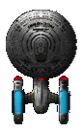

#Asteroids
Asteroids only appear on the first level. There are three types of asteroids - small, medium and large as shown below:

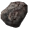

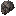

The asteroids will appear at random intervals and in random locations at the top of the screen. They fall straight down toward the bottom of the screen. They must be avoided by the player. If one hits the player, it costs the player a life.

#Phaser
Phasers are used in each level. Any ship can fire a phaser. There are red phasers used by federation ships and green phasers used by the borg or the romulan warbird. Phasers travel in a straight line and their velocity cannot be changed.

When being fired at the player by the warbird or by the borg ship, phasers have a player aware AI in that they are always fired toward the player at a constant velocity. For grading purposes, this is most easily observed in level 2 as in level 3 the phasers are often intercepted by other members of the fleet.

#Romulan Warbird
The romulan warbird only appears in level two. It is represented by the following image:

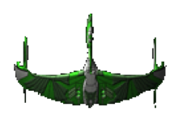

The warbird moves randomly around the screen and fires phasers at the Enterprise at semi-random intervals. The warbird must be hit by phasers several times to destroy it.

#Borg Ship
The borg ship only appears in level 3 and is represented by the following image:

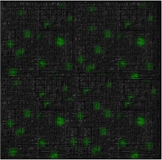

The borg ship does not move, but the player can collide with it and phasers can collide with it. The borg fires three different weapons - mines, torpedos, and phasers. The behavior of mines and torpedos are explained below.

#Mines
The borg ship will lay mines. The mines select a position on screen to move to randomly, and do so in the first few seconds of their existence. The mine then stays there until a ship collides with it. They are represented by the image below:

#Torpedos
The borg ship will fire torpedos in level 3. They are represented by the following image:

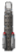

Torpedos can be fired at members of the fleet or at the Enterprise. The target is selected randomly, and the torpedo is aware of the target while in persuit, making it the second player aware AI thing. Instead of merely firing at the initial position of the target, however, torpedos constantly track the position of their target and adjust velocity accordingly. They can be destroyed by a phaser hit.

#Fleet Ships
In level three, the Enterprise is assisted in its fight against the borg by other ships from Star Fleet. They appear randomly during level three, move around the screen randomly, and fire phasers at the borg ship. They can be attacked by any of the borg weapons listed above in the same way the borg attacks the player and can be destroyed when they have experienced enough damage. Each ship is selected randomly from the sprites listed below:

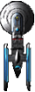
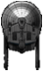
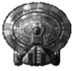
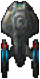
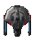
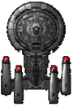
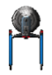
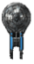
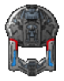

##Levels (Gameplay Description)
#Level 1: Asteroids
Asteroids will randomly appear and move from the top of the screen toward the bottom of the screen where the player is. The player will be able to move left and right (using the left and right arrow keys) to avoid the asteroids or fire a phaser to destroy an asteroid by pressing the "w" key. The level is won if the player survives 25 seconds without losing a life. If the player loses a life, which will occur uppon being hit by an asteroid, they will have to restart the level.

The background of this level is shown below:
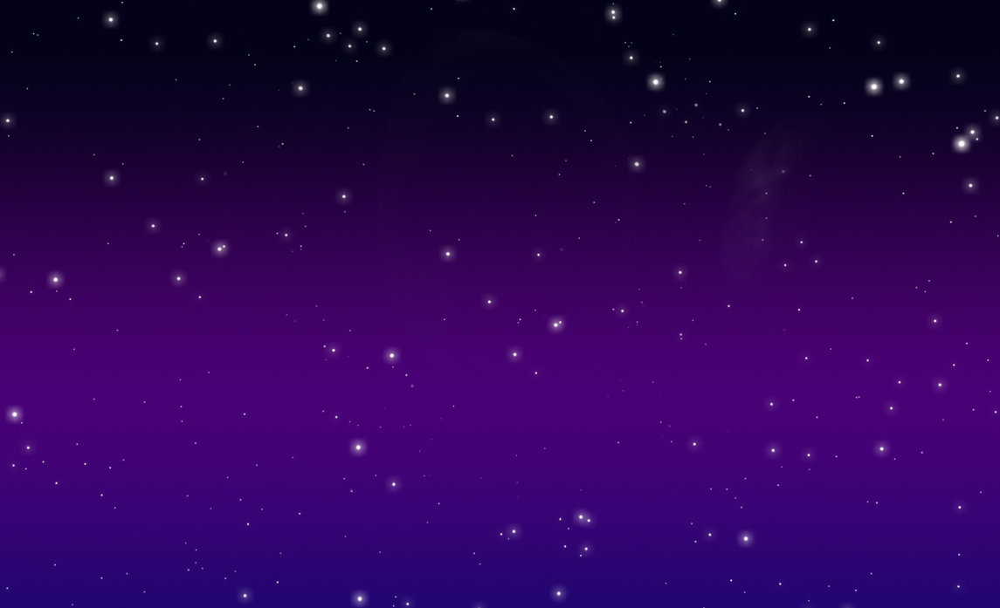

#Level 2: Romulans
The enterprise will have to battle a Romulan Warbird. The player can control the Enterprise with the arrow keys to move anywhere on the screen(left to go left, up to go up, etc.). The Enterprise can fire phasers in 4 directions using the w, a, d, and x, keys to chose a direction. "W" will fire forward, "x" backward, A to the left, and so on. The phasers of the Warbird will have a player aware AI in that they will shoot at the current position of the player. The warbird itself will move randomly around the screen. The Warbird will have to be hit five times to be destroyed. If the player loses a life, they must restart the level, meaning the Warbird will still have to be hit five times to be destroyed.

#Level 3: The Borg
The Enterprise will have to battle a borg ship with the rest of the fleet. The player will not be able to collide with the rest of the fleet, but he or she will lose a life if they collide with the borg. The Enterprise will still be able to use phasers as in level 2 and its motion will be controled with the arrow keys as in level two. The borg will have three weapons: it can fire a phaser beam; it can lay mines that will explode on contact with any ship; and it can fire torpedos that will follow a ship. The focus of the Borg will not only be on the Enterprise, but on the rest of the fleet as well meaning it will fire any of the above listed weapons at any member of the fleet.

#Scoring and Lives
The player will begin with 100 "health points." Health points will be lost for the following:
* -20 when hit by a romulan or borg phaser
* -50 when hit by a Borg torpedo
* -75 when hit by a Borg mine

The player will begin with 3 lives. Lives will be lost for the following:
* Health points dropping below zero
* Being hit by an asteroid
* Colliding with the Romulan Warbird
* Colliding with the borg ship

The player begins with a score of zero. The player will gain points for the following:
* +5 for every asteroid he or she avoids
* +10 for every asteroid he or she destroys
* +10 for hitting the borg ship with a phaser
* +15 for destroying a mine with a phaser
* +20 for destroying a torpedo with a phaser
* +10 for hitting the Warbird with a phaser

##Interface Notes

#General
There is a menu bar at the top of the screen. It includes two menus. First is file, which has the following buttons (not necessarily in this order):
* Pause: pauses gameplay if running. If the gameplay is already paused, this will change to the restart button.
* Quit: quits the game
* High Scores: Shows the high scores list
* New Game: Starts a new game

The second is the grading menu, which has three buttons, each corresponsing to one of the three levels. Clicking on one of these buttons will jump the grader immediately to the corresponding level so the grader will not have to beat every level to observe every component of the game.

When first begun, the screen shows a line edit where the user can enter their name and a start game button. When the user presses "Start Game," the game is begun at level one. Entering a name is optional, but note that scores without a name will not be stored in the High Scores list even if they qualify.

##Closing Notes
Everything else that is required knowledge for this game is documented in the README.md file in this same directory.
