# A Game of Chicken
##Overview
This game will be a top-down game that will be modeled after the classic game of chicken as is often used to model brinkmanship.
The basic premise of the game is quite simple: there are two cars. the two start a set distance away from each other on a relatively straight road. The driver of each car accelerates toward the other. The first person to swerve is called the chicken and has lost the game.
The challenge of the game is to decide whether or not you think the other driver will swerve as you get closer.

####Landcape
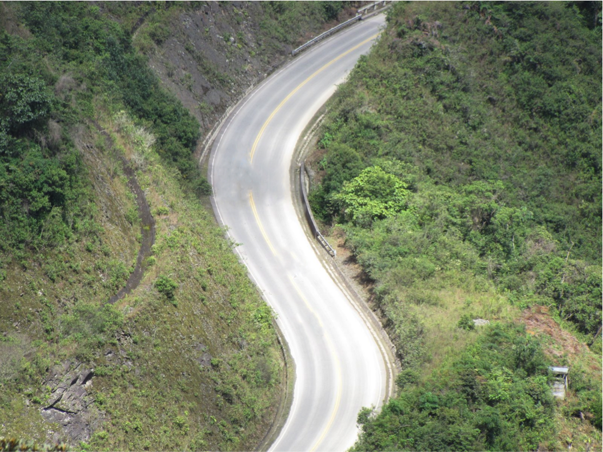

## Interface
The first screen will ask for the user's name and include a next button. The next button will take the user to another screen where they can select which car (see Possible Cars) they want to use. When the click on the car, gameplay will begin as described below.

The menu bar will include a number of options including pause, stop, and new game buttons. These will be contained in drop-down menues in the menu bar.

During gameplay, the user's score will be displayed next to his or her name above the landscape in the window.

##The Cars/Basic Gameplay
###Introduction
There will be two cars. One car will be controlled by the user and the other will be controlled by the computer. The user will be able to select his or her style of car from the options displayed below. The computer's car will be selected randomly from the cars not selected by the user.

####Possible Cars:
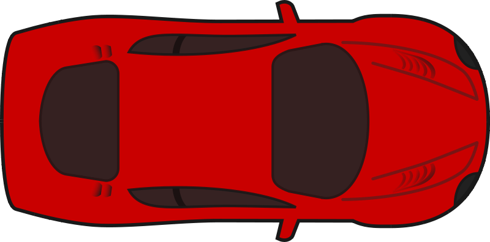
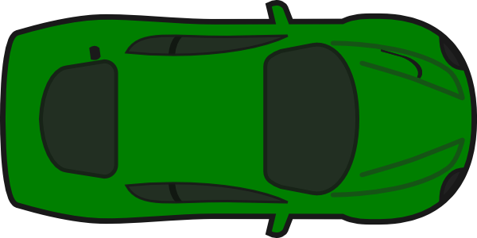
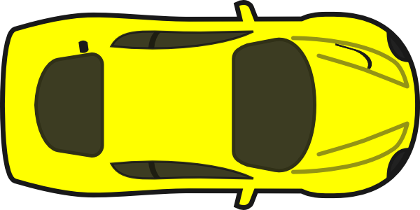
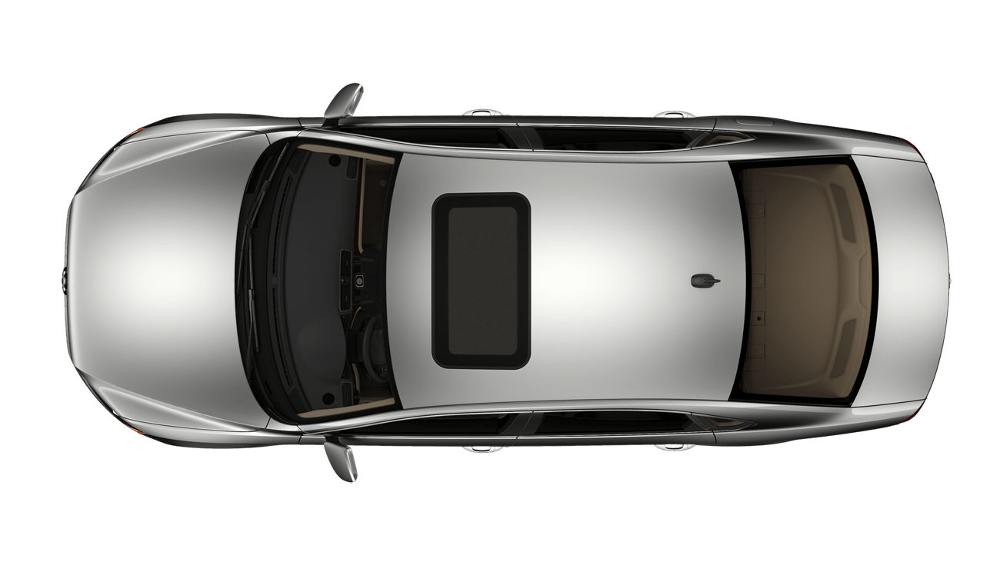
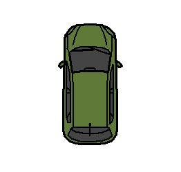

###Controls
The user will have three controls:
* Accelerate: this will increase the speed of the user controlled car progressively. This will be the up arrow.
* Swerve: This will make the card swerve off the road to avoid a collision with the other vehicle. This will be the space bar.
* Throw out the steering wheel: This signals to the computer player that the user has no way of swerving to avoid the collission. This was a common strategy used by the original players of chicken to indicate they are completely commited to continuing forward. This action will alter the computer's strategy as described below. This will be the *x* key.

###Collisions
A collision will occur if neither the computer nor the user decides to swerve. A collision will result in points and the loss of one life. Each player will have three lives. The method for determining scoring is described in detail in the **Scoring** section.

###Computer Strategies
The computer will select from the following strategies:
* Randomly decide whether or not it is going to swerve
* 75% chance it will swerve
* 25% chance it will swerve
* Throw out the steering wheel (indicates it definitely won't swerve)
* 100% swerve: it definitely won't swerve, but does not signal its intent to the user
* Fake swerve: looks like it's going to swerve, but changes its mind
If the computer decides to swerve, it will swerve at different distances from the user's car so the user cannot predict at what point the computer will swerve if it does.

###Steering Wheel
As described above, either player will have the ability to throw out the steering wheel. The possible steering wheels are listed below:

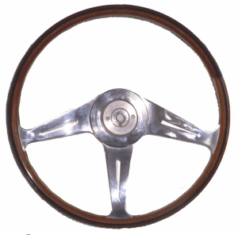
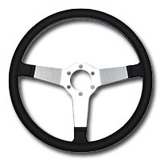

##Interfering Objects/Twists
The game will include two objects that will interfere randomly.

###Falling Rocks
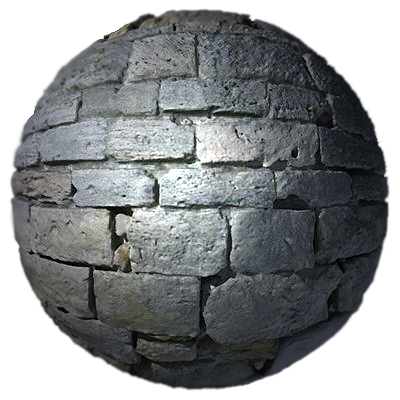

The boulder will roll down the hill. If the player accelerates normally (continually holds the acceleration key), the boulder will collide with the user's car and result in the loss of one life.

###Tumbleweed
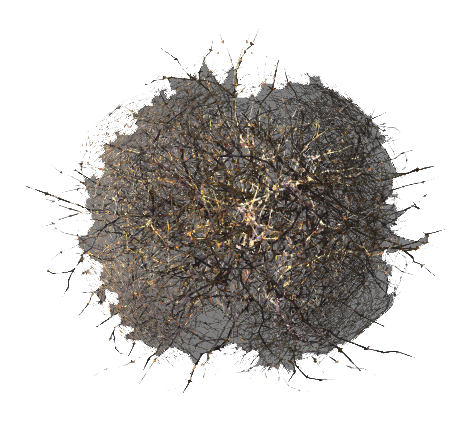

The tumbleweed will also appear randomly, and if the user fails to avoid it, it will blind the user (all visuals will disappear so the user will in effect be driving blind).

###Police Cars
The police will show up at random intervals. They will appear in two possible scenarios:
* At the beginning of the round, it will appear on either side of the course. The car that swerves will lose more points than normal and a life because they were caught.
* At the end of the round. This will not appear often, but will mean that the player will lose a significant amount of points (see scoring) and a life for being caught.

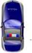

##Scoring
The player will begin with 100 points. If his or her points fall to zero, they have lost the game. The following will result in increases or loss of points:
* Collision with the computer controlled car: -25
* Swerve: -15
* Win (Don't swerve and computer does swerve): +50
* Caught by police: -25

1 life will be lost for the following:
* Collission with the boulder
* Both the computer and the player swerves
* Collission between the two cars
* Being caught by the police (see Police Cars)

